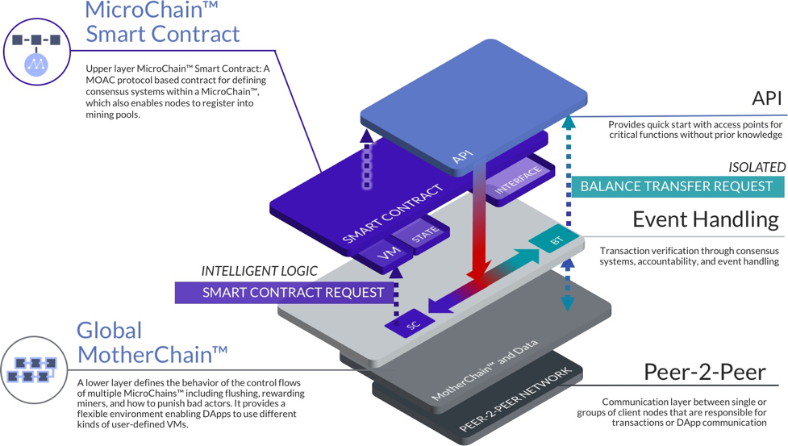

MOAC区块链
^^^^^^^^^^^^

现有技术和区块链平台对于用户来说学习曲线非常陡峭，技术复杂的同时使用费用也很高昂——所有这些都会影响区块链技术的市场接受度以及可扩展性。现有平台交易处理速度很低，共识模型固定，并且无法快速适应开发人员不断增长的需求。迄今，区块链社区的挖矿高度集中，并且由于复杂性和硬件成本的问题，未能有效激励更多的新用户和感兴趣的消费者进入区块链领域。

这些区块链平台也彼此隔离，每个区块链平台上的通证和智能合约与其他区块链底层难以进行有效沟通。于是现有区块链市场根据不同的平台技术形成了各自封闭的圈子，其平台、技术、用户基础和行业也是彼此隔离的。

即使对于有经验的技术开发人员来说，构建新的区块链目前也极具挑战性。导致局面更加复杂的是大多数区块链底层技术很难升级；同时，不同底层技术使得整个区块链的用户被低效的分离到不同的区块链底层平台上。

MOAC基金会（MOAC Foundation）通过开发分层分片的群链技术解决了现有区块链平台的低效问题。MOAC平台采用先进的分层架构，可降低DApp开发人员的成本，提供可扩展性并降低开发复杂度，同时使用分片技术提高交易速度和交易量。MOAC在其平台内利用群链技术，包括母链（基于工作量证明的底层区块链）和应用链（使用多种共识机制的上层区块链），来支持多种共识机制的智能合约。MOAC平台还具有跨链功能， 不但支持MOAC平台上不同应用链间的互联，也支持与其他区块链底层及其上的加密货币的互联互通。

MOAC首先提出并实现了为每个智能合约提供定制应用链的区块链解决方案，比现有智能合约执行的解决方案效率更高，且扩展性更强。

MOAC平台使用应用链来实现智能合约的业务逻辑，从而避免了在同一条链上同时处理常规的区块链任务（如交易的共识和记录）和与业务紧密相关的逻辑（通过智能合约方式实现）。通过为每个智能合约提供为其定制的应用链，开发人员可以自由选择最适合其使用场景的共识算法，并确定分配给智能合约的节点数量，从而可以支持更多的使用场景。智能合约的所有状态都保存在本地应用链中，且可根据需要将数据写入母链。

1. :doc:`MotherChain`
2. :doc:`MicroChain`

