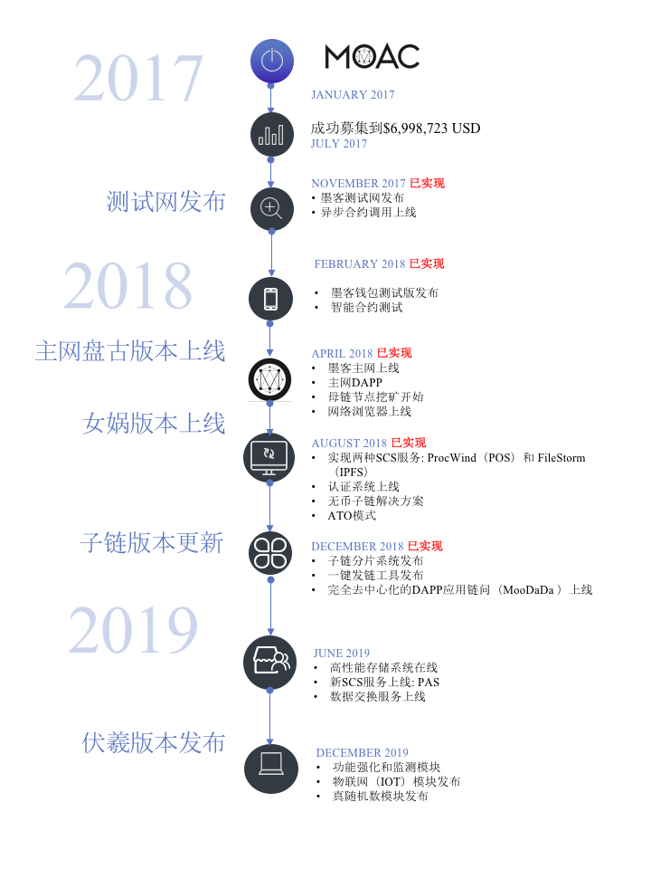

项目路线图
==========================

**1.盘古 (Pangu)**

*内部版本识别号 (Version)：0.8*

发布日期： 3/31/2018

主要功能点：

* 母链节点 VNODE，支持POW共识;
* 应用链节点 SCS;
* 应用链上支持独立智能合约的部署和执行;
* 母链对应用链的通信支持和验证;

**2.女娲（Nuwa）**

*内部版本识别号(Version)：1.0*

发布日期： 7/30/2018 

主要功能点：

* 母链节点 VNODE 实现完整分片功能;
* 应用链节点 SCS 实现支持多条应用链;
* 单一应用链上可以支持多条智能合约的部署和执行;
* 母链和应用链之间可以实现原子跨链交易;
* 实现ProcWind应用链；
* 实现和母链具有原子跨链交易moac的应用链；
* 实现和母链具有原子跨链交易ERC 20 TOKEN的应用链；
* 实现支持IPFS的应用链；

**3.伏羲（Fuxi）**

*内部版本识别号(Version)：1.1*

预期发布日期： 12/30/2019

主要功能点：

* 实现阈值签名（BLS）的应用链;
* 对物联网应用链的支持;

**4. 神农（Shennong）**

*内部版本识别号(Version)：1.2*

预期发布日期： 12/30/2020

主要功能点：

* 母链共识机制优化;
* 高性能TPS支持（>10k）;
* 零知识证明;
* 大数据存储和交易;
